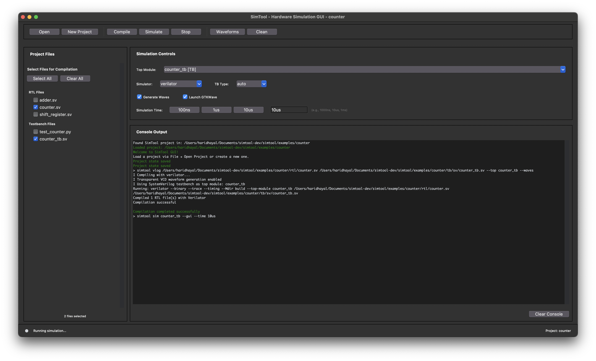
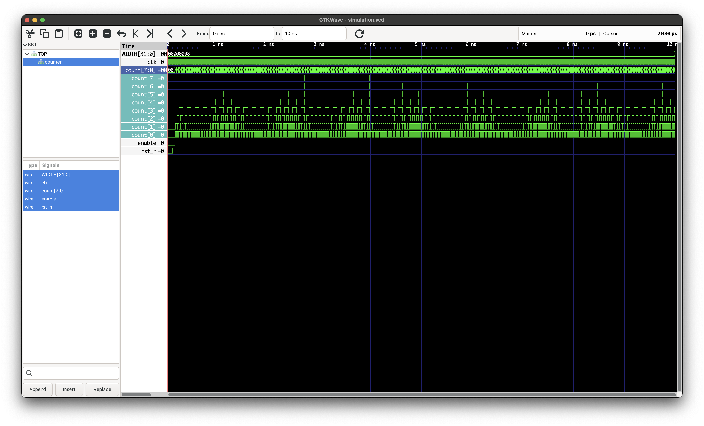

# SimTool

[](https://opensource.org/licenses/MIT)
[](https://www.python.org/downloads/)
[](https://github.com/haridhayal11/simtool)

A modern CLI and GUI tool that bridges ModelSim workflows to open-source simulation tools like Verilator, cocotb, and GTKWave.

**Perfect for students and engineers transitioning from proprietary ModelSim to open-source EDA tools**

## Screenshots

### GUI Interface


### Waveform Viewer


## Features

- **Familiar Commands**: ModelSim-style CLI (`vlog`, `sim`) with automatic testbench detection
- **Modern GUI**: Visual project management with system native theme
- **Cross-Platform**: Works on Linux and macOS
- **Multiple Simulators**: Verilator support (Icarus Verilog, GHDL coming soon)
- **Integrated Waveforms**: Automatic GTKWave integration
- **Seamless Migration**: Drop-in replacement for common ModelSim workflows
- **Project Management**: Organized directory structure with build automation

## Installation

### Prerequisites

Install the required simulators and tools:

```bash
# macOS
brew install verilator gtkwave python-tk

# Ubuntu/Debian
sudo apt update
sudo apt install verilator gtkwave python3-tk python3-pip

# Fedora/CentOS
sudo dnf install verilator gtkwave python3-tkinter python3-pip
```

### Install SimTool

```bash
# Clone and install from source
git clone https://github.com/haridhayal11/simtool.git
cd simtool
pip install -e .

# Verify installation
simtool doctor
```

### First Run

```bash
# Launch GUI
simtool-gui

# Or use CLI
simtool init
simtool vlog rtl/*.sv --top my_module
simtool sim my_module --waves --gui
```

## Quick Start

### CLI Workflow
```bash
mkdir my_design && cd my_design
simtool init                           # Initialize project
simtool vlog rtl/*.sv --top counter    # Compile RTL
simtool sim counter --waves --gui      # Simulate with waveforms
```

### GUI Workflow
1. Launch `simtool-gui`
2. Create new project or open existing
3. Select files to compile
4. Set top module and options
5. Click Compile → Simulate → View Waves

## Commands

| Command | Description | Example |
|---------|-------------|---------|
| `init` | Initialize project | `simtool init` |
| `vlog` | Compile RTL files | `simtool vlog *.sv --top cpu` |
| `sim` | Run simulation | `simtool sim cpu --waves` |
| `doctor` | Check installation | `simtool doctor` |
| `clean` | Clean build files | `simtool clean` |

## Project Structure

```
my_project/
├── rtl/           # RTL source files
├── tb/            # Testbenches (Python/cocotb, SystemVerilog, C++)
├── work/          # Build artifacts
└── simtool.cfg    # Configuration
```

## Configuration

Creating a new project will create `simtool.cfg` in your project:

```yaml
default_simulator: verilator
default_waves: true
rtl_paths: [rtl, src]
tb_paths: [tb]
build_dir: work
```

## Migrating from ModelSim

| ModelSim | SimTool |
|----------|---------|
| `vlib work` | `simtool init` |
| `vlog *.sv` | `simtool vlog *.sv` |
| `vsim -voptargs=+acc top` | `simtool sim top --waves` |

## Requirements

### Core Requirements
- **Python 3.8+** - Programming language runtime
- **Verilator** - Fast SystemVerilog simulator
- **tkinter** - GUI framework (usually included with Python)

### Optional Tools
- **GTKWave** - Waveform viewer (highly recommended)
- **cocotb** - Python testbench framework (auto-installed)
- **Make** - Build automation (usually pre-installed)

### Supported Platforms
- **Linux**: Ubuntu 18.04+, Fedora 30+, CentOS 8+
- **macOS**: 10.15+ (Intel/Apple Silicon)

## Example Projects

Check out the [`examples/counter/`](https://github.com/haridhayal11/simtool/tree/main/examples/counter) directory for a complete working example with:
- RTL counter implementation
- Python cocotb testbench
- SystemVerilog testbench
- Complete project setup

## Contributing

Contributions are welcome! Please feel free to:
- Report bugs and request features via [GitHub Issues](https://github.com/haridhayal11/simtool/issues)
- Submit pull requests for improvements
- Share feedback and suggestions

## Support

- **Documentation**: Check the README and example projects
- **Bug Reports**: [Create an issue](https://github.com/haridhayal11/simtool/issues/new)
- **Feature Requests**: [Start a discussion](https://github.com/haridhayal11/simtool/discussions)

## Roadmap

- [ ] Support for additional simulators (Icarus Verilog, GHDL)
- [ ] Formal verification integration
- [ ] DMA engine support for streaming
- [ ] Linux driver integration (UIO)
- [ ] Package distribution via PyPI

## License

This project is licensed under the MIT License - see the [LICENSE](https://github.com/haridhayal11/simtool/blob/main/LICENSE) file for details.

---

**Star this repo if SimTool helps you transition from ModelSim to open-source tools!**